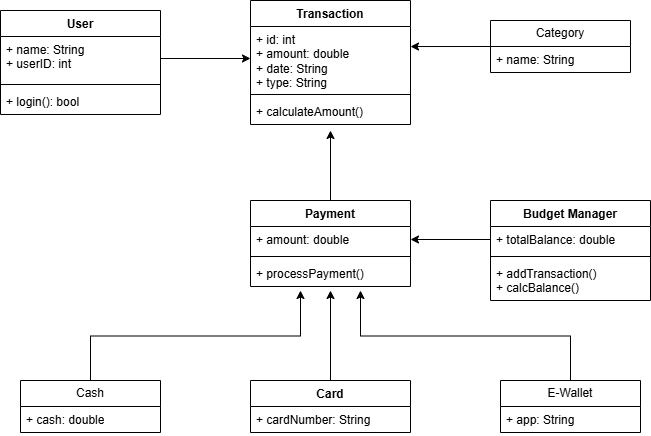
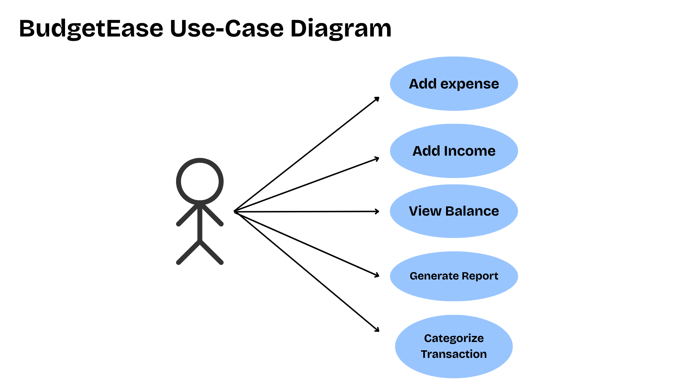

# BudgetEase 💸

BudgetEase is a simple and intuitive budget management app designed to help users track their income, expenses, and financial goals with ease.

---

## 🚀 Features
- Track income and expenses
- Categorize transactions
- Set budget limits
- View spending summaries
- Simple and user-friendly interface

---

## 📦 Installation

1. Clone the repository:

```bash
git clone https://github.com/realtimzkie/BudgetEase.git
```
## 📊 Diagrams

### Class Diagram


### Use Case Diagram

