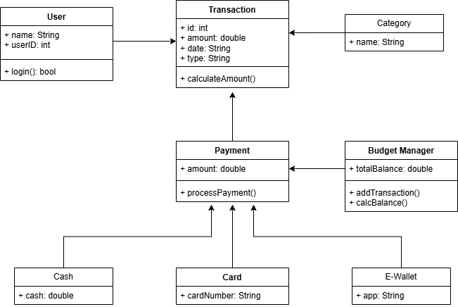
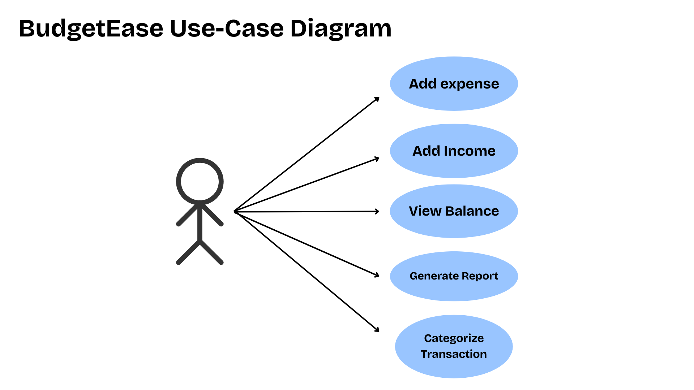

# BudgetEase 💸

BudgetEase is a simple and intuitive budget management app designed to help users track their income, expenses, and financial goals with ease.

---

## 📝 Overview
BudgetEase helps individuals and households take control of their finances by simplifying expense tracking and budget planning. Whether you're saving for a goal or just want to avoid overspending, BudgetEase makes money management effortless.

---

## 🚀 Features
- Track income and expenses
- Categorize transactions
- Set budget limits
- View spending summaries
- Simple and user-friendly interface

---

## 📸 Screenshots
### Class Diagram


### Use Case Diagram


---

## 📦 Installation

1. Clone the repository:
```bash
git clone https://github.com/realtimzkie/BudgetEase.git
Navigate to the project folder:

bash
cd BudgetEase
Install dependencies:

bash
npm install
Run the app:

bash
npm start
🛠️ Usage
Add your income sources.

Record expenses and categorize them.

Set monthly budget limits.

View summaries and track progress toward goals.

🤝 Contributing
Contributions are welcome!

Fork the repo

Create a feature branch (git checkout -b feature-name)

Commit changes (git commit -m "Add feature")

Push to branch (git push origin feature-name)

Open a Pull Request

---

## 💻 Running the GUI (Java Swing)

You can run the provided Swing GUI which wraps the existing `BudgetManager` logic.

From the project root (where `src` is located) compile and run with these commands:

Windows (PowerShell or CMD):

```powershell
javac -d out src\budgetease\*.java
java -cp out budgetease.BudgetEaseGUI
```

Notes:
- Java 8 or newer is required.
- If you prefer an IDE, import the project as a Java project and run the `main` method in `BudgetEaseGUI`.
